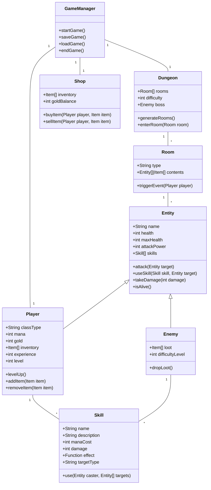

# **Core Classes**

1. **GameManager**
    - **Responsibilities**: Manage the game's lifecycle (start, save, load, etc.).
    - **Methods**:
      - `startGame()`
      - `saveGame()`
      - `loadGame()`
      - `endGame()`

---

# **Entity Class Hierarchy**

2. **Entity** (Base Class)
    - **Attributes**:
      - `name` (string): The entity's name.
      - `health` (number): Current health points.
      - `maxHealth` (number): Maximum health points.
      - `attackPower` (number): Base damage dealt in attacks.
      - `skills` (Skill[]): Array of skills the entity can use.
    - **Methods**:
      - `attack(target: Entity)`: Performs a basic attack on a target.
      - `useSkill(skill: Skill, target: Entity)`: Executes a skill.
      - `takeDamage(damage: number)`: Reduces health based on incoming damage.
      - `isAlive()`: Returns `true` if health > 0.

3. **Player** (Inherits from `Entity`)
    - **Attributes**:
      - `classType` (string): "Warrior" or "Magician."
      - `power` (number): Current power points (used for skills). For Magicians, this is mana; for Warriors, this is rage.
      - `gold` (number): Player’s currency.
      - `inventory` (Item[]): List of items owned.
      - `experience` (number): Current experience points.
      - `level` (number): Player's level.
    - **Methods**:
      - `levelUp()`: Increases player level and stats.
      - `addItem(item: Item)`: Adds an item to the inventory.
      - `removeItem(item: Item)`: Removes an item from the inventory.

4. **Enemy** (Inherits from `Entity`)
    - **Attributes**:
      - `loot` (Item[]): Items or gold dropped on defeat.
      - `difficultyLevel` (number): Difficulty rating (used for dungeon scaling).
    - **Methods**:
      - `dropLoot()`: Returns the loot dropped by the enemy.

---

# **Skill System**

5. **Skill**
    - **Attributes**:
      - `name` (string): Name of the skill.
      - `description` (string): Description of what the skill does.
      - `powerCost` (number): Power required to use the skill. For Magicians, this is mana; for Warriors, this is rage.
      - `damage` (number): Damage dealt by the skill (if applicable).
      - `effect` (function): Custom function to apply the skill's effect.
      - `targetType` (string): "Self," "Single Enemy," or "All Enemies."
    - **Methods**:
      - `use(caster: Entity, target: Entity | Entity[])`: Applies the skill's effect.
    - **Example Skills**:
      - `Slash`: Physical attack for Warriors (single-target damage).
      - `Fireball`: Magical attack for Magicians (area-of-effect damage).
      - `Heal`: Restores health to the caster or an ally.

---

# **Dungeon System**

6. **Dungeon**
    - **Attributes**:
      - `rooms` (Room[]): Array of rooms in the dungeon.
      - `difficulty` (number): Difficulty level of the dungeon.
      - `boss` (Enemy): Final boss of the dungeon.
    - **Methods**:
      - `generateRooms()`: Creates a random sequence of rooms.
      - `enterRoom(room: Room)`: Handles events in a specific room.

7. **Room**
    - **Attributes**:
      - `type` (string): "Combat," "Treasure," "Trap," or "Boss."
      - `contents` (Entity[] | Item[] | null): Entities or items present in the room.
    - **Methods**:
      - `triggerEvent(player: Player)`: Executes the room's event logic.

---

# **Shop System**

8. **Shop**
    - **Attributes**:
      - `inventory` (Item[]): Items available for purchase.
      - `goldBalance` (number): Currency available for transactions.
    - **Methods**:
      - `buyItem(player: Player, item: Item)`: Transfers item to the player if they have enough gold.
      - `sellItem(player: Player, item: Item)`: Buys an item from the player.

---

# **Class Relationships**

1. **Entity** is the base class for both **Player** and **Enemy**.
2. **Player** and **Enemy** have an array of **Skill** objects that define their abilities.
3. **Dungeon** manages a collection of **Room** objects, and each room can contain **Enemy** or **Item** objects.
4. **Shop** interacts with **Player** by buying and selling **Item** objects.

---

